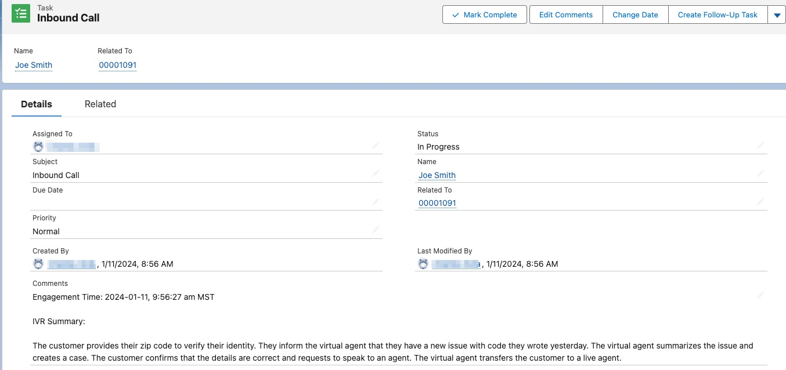
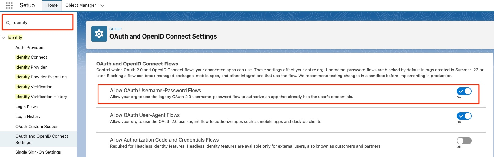

# Setup
## Conversation Relay Configuration
You must setup a Twiml Bin to get the call over to conversation relay. This will be called from the studio flow. Here is the sample to use
<?xml version="1.0" encoding="UTF-8"?>
<Response>
  <Connect>
    <Assistant id="aia_asst_019321b2-d23f-7b89-9af1-38e569eec609" welcomeGreeting="Thank you for calling Rivian. How can I help you today?" ttsProvider="Elevenlabs" voice="OYTbf65OHHFELVut7v2H" language="en-US">
    </Assistant>
  </Connect>
</Response>

Female Voice examples:
OYTbf65OHHFELVut7v2H - {'accent': 'american', 'descriptive': 'crisp', 'age': 'young', 'gender': 'female', 'language': 'en', 'use_case': 'conversational'}
iCrDUkL56s3C8sCRl7wb - {'accent': 'american', 'descriptive': 'calm', 'age': 'young', 'gender': 'female', 'language': 'en', 'use_case': 'narrative_story'}
8N2ng9i2uiUWqstgmWlH - {'accent': 'british', 'descriptive': 'gentle', 'age': 'middle_aged', 'gender': 'female', 'language': 'en', 'use_case': 'narrative_story'}


# Twilio Serverless Package for SFDC Data Integration

This serverless package provides six (6) serverless functions for interacting with a Salesforce environment.  These functions leverage Salesforce [JSForce](https://www.npmjs.com/package/jsforce) npm package. 

Examples for contact lookup, case creation, comment creation and task creation are provide as template for enabling self-service flows in common voice and digital Twilio Studio Flows.

`IMPORTANT`
Deployment of this serverless package with the given function filenames (below) results in serverless endpoints with PUBLIC URI access.  This naming is not recommended for PROD environments and only used for development/testing.

BEST PRACTICE would be to rename each of the functions to be of the syntax

```sh
sfdcContactLookup.ls (public) ==> sfdcContactLookup.protected.js
```


## Function Descriptions

### sfdcContactLookup.js

This function accepts a PSTN e.164 telephony number and queries SFDC to find a contact record with the same number.  Upon lookup, the contact's email, mobile phone, SFDC object id and phone are returned.

Example query:
```sh
`SELECT Id, Name, MobilePhone, Email, Phone FROM Contact where Phone='${lookupNumber}'`
```
Note: This SOQL query can be modified by the end-user to retrieve any additional contact data.

### sfdc-createCase.js
This function requires the following inputs (contactId, subject, priority) to create a new SFDC case that is associated to the SFDC contact (contactId).  The case JSON details are returned upon success.

### sfdc-createCaseComment.js
This function requries a valid SDFC case objectId to create a new comment that is assoicated with the case.  This operation is typical of self-service use cases for provide additional information/details on an existing case.

### sfdc-createSfdcTask.js
This function creates a new SFDC engagement task record that is assoicated with either the contact or case.  Details of the channel, engagement direction, description of the interaction and time/date are captured with in associated task.



Note: This function provides an example of data that can be written. End users can change/augment the "description" text appropriately.

### sfdc-getCaseByNumber.js
This fuctions retrieves a SFDC case given a valid SFDC case number (e.g. 00001028).  This number is generally captured wihtin the self-service flow and passed to the function.

The following data elements around the case are retrieved:
- Case id (object id)
- Contact Id
- Owner Id
- CaseNumber
- Subject
- Description
- Status

Example query
```sh
`SELECT Id, ContactId, OwnerId, AccountId, CaseNumber, Subject, Description, Status FROM Case WHERE CaseNumber = '${caseNumber}'`
```

Note: This SOQL query can be modified by the end-user to capture any available data about the case.

### sfdc-getOpenCases.js
This function returns the three (3) current cases for a contact given the case status in a "New" or "Working" state.

Example query:

```sh
`SELECT Id, CaseNumber, ContactId, OwnerId, Subject, Status, CreatedDate FROM Case
    WHERE ContactId ='${contactId}' AND (Status='New' OR Status='Working') ORDER BY CreatedDate DESC LIMIT ${limit}`
```
Note: This SOQL query can be modified by the end-user to retrieve any daata associated with the SFDC contact or case(s).


### Pre-Requisites
Usage and deployment of this Twilio Serverless package requires the usage of the Twilio CLI and Serverless plugin.  Complete the following steps:

- Install Twilio CLIL ( https://www.twilio.com/docs/twilio-cli/getting-started/install )
- Install Twilio Serverless Toolkit ( https://www.twilio.com/docs/labs/serverless-toolkit/getting-started )


### Deployment
The following steps are necessary for deployment of the serverless function package.

- Configure package environment variables
- Build the package dependencies
- Deploy the serverless package

## Configure Environment
Use the following command within the root of this package's folder structure.
```sh
cp .env.example .env
```
Configure the following environent variables for your Twilio and SFDC accounts
- ACCOUNT_SID
- AUTH_TOKEN

Configure the following environment variable for your SFDC sandbox and connected app configuration.
- SFDC_USER : SFDC Username associated with Connected App
- SFDC_PWD : SFDC user password and security token (concatenated)
- SFDC_CLIENT_ID : Connected App Consumer ClientId
- SFDC_CLIENT_SECRET : Connected App Consumer Secret
- SFDC_URI : SFDC Sandbox URI 

Note: This package requires creation of a "Connected App" within SFDC with OAuth Username-Password Flows which is enabled in SFDC Setup.  See the screenshot below.




## Build package dependencies
Use Visual Studio Code (or other editor) to build the package dependencies within the root of this package folder structure with this terminal command.

```sh
npm i
```

## Deploy Serverless Package
Deployment of the serverless package is performed using the Twilio CLI and Serverless Toolkit.  Execute the following CLI command via a Terminal window wihtin the root of the package folder structure

```sh
twilio serverless:deploy
```

### Disclaimer
Usage of this Twilio Serverless package is "AS-IS" and provided as a prototype code set from which end-users can use as a template within development environments.  

Usage within "Production" environments is wholly upon end-user code validation and management with no guarantee (implied or inferred) by code author.

### License
MIT

### Author Details
Original work: cavila@twilio.com

### Deploy Conversations for chat
twilio api:conversations:v1:services:configuration:webhooks:update \
    --post-webhook-url=https://shane.ngrok.io/channels/conversations/messageAdded \
    --chat-service-sid=IS109ab255c5ce4602a7fe868133ef572c \
    --filter=onMessageAdded